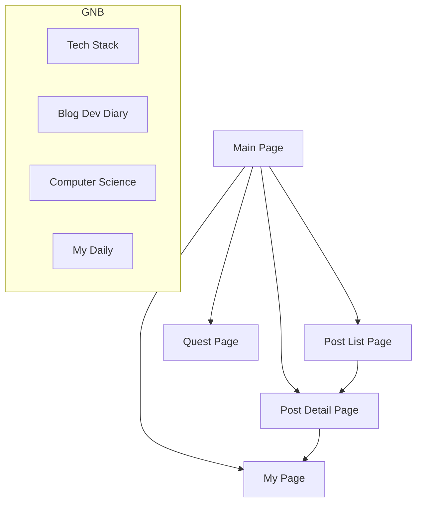

# Storyboard: Code Masterpiece (Levelog)

**프로젝트 명**: Code Masterpiece
**문서 버전**: v1.1
**작성자**: 에이든 리 (Senior Product Strategist)

---

## 1. 인덱스 (Index)

| ID | Category | Feature | Description |
| :--- | :--- | :--- | :--- |
| **CM-00** | **Common** | Layout | Header, Footer, Search Bar |
| **CM-01** | **Main** | Home | 대시보드 및 추천 콘텐츠 |
| **CM-02** | **Sub** | Post List | 게시글 목록 및 필터링 |
| **CM-03** | **Sub** | Post Detail | 게시글 상세, 퀴즈, 댓글 |
| **CM-04** | **Sub** | My Page | 사용자 통계 및 활동 내역 |
| **CM-05** | **Sub** | Quest | 퀘스트 목록 및 랭킹 |

---

## 2. IA (Information Architecture)



---

## 3. 공통 모듈 (Common Modules)

### 3.1. Header (GNB)
*   **Logo**: Code Masterpiece (좌측 상단)
*   **Navigation**: Tech Stack | Blog Dev Diary | Computer Science | My Daily
*   **Search Bar**: 통합 검색 기능 (중앙)
*   **User Menu**:
    *   (비로그인): 로그인/회원가입 버튼
    *   (로그인): [My Page] 아이콘, [Home] 아이콘

### 3.2. Footer
*   **Info**: Logo, Copyright (Mangosteen), Contact Info
*   **Links**: Contact Us, Share, Home Button

---

## 4. 화면 설계 및 Description (Screen Design)

### 4.1. Main Page (CM-01)

**[UI Layout]**
```text
+-------------------------------------------------------+
| [Header] Logo   Menu...   [Search]   [My] [Home]      |
+-------------------------------------------------------+
|                                                       |
| [Content 1: Hero Section]                             |
| "Fun like a game. No more boring study!"              |
| [Daily Quest Progress: 2/3]                           |
|                                                       |
+-------------------------------------------------------+
|                                                       |
| [Content 2: Admin Info & Stats]                       |
| [Profile Img] Aiden Lee (Lv.10 Code Master)           |
| [XP Bar: 80%] [🔔] [Subscribe]                        |
| Streak: 15 Days (Next Reward: 5 Days left)            |
| [Visitor Graph (Line Chart)]                          |
|                                                       |
+-------------------------------------------------------+
|                                                       |
| [Content 3: Slogan Banner]                            |
| "Fun like a game. No more boring study!"              |
|                                                       |
+-------------------------------------------------------+
|                                                       |
| [Content 4: Editor's Pick]                            |
| [Category Filter Buttons]                             |
| +----+ +----+ +----+ +----+                           |
| |Post| |Post| |Post| |Post| (8 items grid)            |
| +----+ +----+ +----+ +----+                           |
|                                                       |
+-------------------------------------------------------+
| [Footer] ...                                          |
+-------------------------------------------------------+
```

**[Description]**
1.  **Hero Section**: 서비스의 핵심 가치를 전달하는 슬로건과 사용자의 당일 퀘스트 진행 상황을 직관적으로 노출.
2.  **Admin Info**: 운영자(에이든)의 프로필과 블로그 방문자 추이를 보여주어 신뢰도 형성. 연속 로그인(Streak) 보상까지 남은 일수를 보여주어 재방문 유도.
3.  **Editor's Pick**: 운영자가 엄선한 추천 게시물 8개를 그리드 형태로 노출. 카테고리 필터 제공.

### 4.2. Post List Page (CM-02)

**[UI Layout]**
```text
+-------------------------------------------------------+
| [Header] ...                                          |
+-------------------------------------------------------+
|                                                       |
| [Content 1: Post List]                                |
| [Category Filter] [Search Post]                       |
| [View Mode: List / Box(Default)]                      |
| +----+ +----+ +----+                                  |
| |Post| |Post| |Post| (12 items grid)                  |
| +----+ +----+ +----+                                  |
| [Pagination: 1 2 3 4 5 >]                             |
|                                                       |
+-------------------------------------------------------+
|                                                       |
| [Content 2: My Info Sidebar]                          |
| [Profile Img] User Name                               |
| Lv.5 Junior Developer                                 |
| [XP Bar: 45%]                                         |
|                                                       |
+-------------------------------------------------------+
|                                                       |
| [Content 3: Recommended]                              |
| [Category Filter]                                     |
| +----+ +----+ +----+ +----+                           |
| |Rec | |Rec | |Rec | |Rec | (4 items)                 |
| +----+ +----+ +----+ +----+                           |
|                                                       |
+-------------------------------------------------------+
```

**[Description]**
1.  **Post List**: 한 페이지당 12개의 게시글 노출. 리스트형/박스형 뷰 모드 전환 기능 제공.
2.  **My Info**: 사이드바(또는 상단)에 로그인한 사용자의 간략한 정보(레벨, XP)를 노출하여 소속감 부여.
3.  **Recommended**: 하단에 추천 게시물 4개를 배치하여 지속적인 콘텐츠 소비 유도.

### 4.3. Post Detail Page (CM-03)

**[UI Layout]**
```text
+-------------------------------------------------------+
| [Header] ...                                          |
+-------------------------------------------------------+
|                                                       |
| [Content 1: Article Body]                             |
| Title: Understanding React Hooks                      |
| [Like ♥] [Comment 💬] [View 👁️]                      |
|                                                       |
| (Content Text...)                                     |
| ...                                                   |
|                                                       |
| [Mini Quiz]                                           |
| Q. What is the dependency array?                      |
| ( ) Option A  ( ) Option B                            |
| [Submit]                                              |
|                                                       |
| [Author Info]                                         |
| [Profile] Aiden Lee (Lv.10) [XP Bar]                  |
|                                                       |
| [Comments Section]                                    |
|                                                       |
+-------------------------------------------------------+
|                                                       |
| [Content 2: Related Posts]                            |
| [Category Filter]                                     |
| +----+ +----+ +----+ +----+                           |
| |Rel | |Rel | |Rel | |Rel | (8 items)                 |
| +----+ +----+ +----+ +----+                           |
|                                                       |
+-------------------------------------------------------+
```

**[Description]**
1.  **Article Body**: 콘텐츠 집중도를 높인 레이아웃. 하단에 미니 퀴즈를 배치하여 학습 확인 및 보상 지급.
2.  **Author Info**: 작성자의 레벨과 칭호를 노출하여 전문성 강조.
3.  **Related Posts**: 연관 게시물 8개를 추천하여 이탈 방지.

### 4.4. My Page (CM-04)

**[UI Layout]**
```text
+-------------------------------------------------------+
| [Header] ...                                          |
+-------------------------------------------------------+
|                                                       |
| [Content 1: User Dashboard]                           |
| [Profile Img] User Name (Lv.5) [XP Bar]               |
| [Settings: 🔔 | Subscribe]                            |
| Stats: [Comments: 12] [Visits: 150]                   |
| [Edit Profile] [Delete Account]                       |
|                                                       |
| [My Activity Tabs]                                    |
| [Liked Posts] [My Comments] [Replied Posts]           |
| - List Item 1                                         |
| - List Item 2                                         |
| (10 items per page) [Pagination]                      |
|                                                       |
+-------------------------------------------------------+
|                                                       |
| [Content 2: My Info Summary]                          |
| (Sticky Sidebar)                                      |
| [Profile] Name, Level, Title, XP                      |
|                                                       |
+-------------------------------------------------------+
|                                                       |
| [Content 3: Recommended]                              |
| +----+ +----+ +----+ +----+                           |
| |Rec | |Rec | |Rec | |Rec | (4 items)                 |
| +----+ +----+ +----+ +----+                           |
|                                                       |
+-------------------------------------------------------+
```

**[Description]**
1.  **User Dashboard**: 사용자의 모든 활동 내역(좋아요, 댓글 등)을 탭으로 구분하여 조회 가능.
2.  **Stats**: 방문 수, 댓글 수 등 활동 지표 시각화.

### 4.5. Quest Page (CM-05)

**[UI Layout]**
```text
+-------------------------------------------------------+
| [Header] ...                                          |
+-------------------------------------------------------+
|                                                       |
| [Content 1: Season Info]                              |
| Season 1: The Beginning                               |
| Season Level: 5  [Reward: Golden Badge]               |
| Streak: 🔥 15 Days                                    |
|                                                       |
+-------------------------------------------------------+
|                                                       |
| [Content 2: Quest List]                               |
| [Daily] [Weekly] [Achievement]                        |
| [v] Read 1 Article (+10 XP)                           |
| [ ] Solve 3 Quizzes (+30 XP)                          |
| ...                                                   |
|                                                       |
+-------------------------------------------------------+
|                                                       |
| [Content 3: Ranking & Global Goal]                    |
| [Real-time Ranking]                                   |
| 1. UserA  2. UserB  3. UserC                          |
|                                                       |
| [Global Goal]                                         |
| Total Quizzes Solved: 1,234 / 10,000                  |
| [==================----] 12%                          |
|                                                       |
+-------------------------------------------------------+
```

**[Description]**
1.  **Season Info**: 시즌제 운영을 통해 주기적인 동기 부여 제공.
2.  **Quest List**: 일일/주간/업적 퀘스트를 탭으로 분리하여 관리.
3.  **Global Goal**: 전체 유저가 함께 달성하는 공동 목표를 제시하여 협동심 유발.